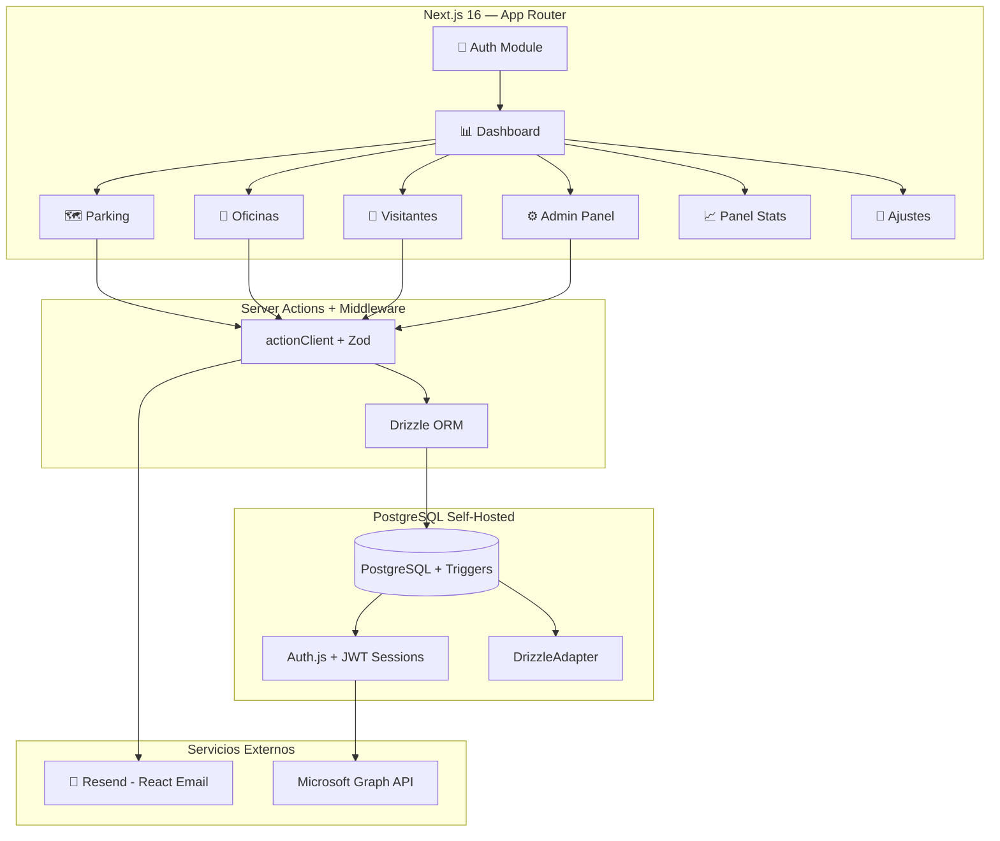

# GRUPOSIETE Reservas

**ERP modular de reservas corporativas: plazas de parking y escritorios de oficina, con tres roles, integración Microsoft 365 y configuración por recurso**

---

## 🎯 El Problema

[GRUPOSIETE](https://gruposiete.com) necesitaba gestionar dos tipos de recursos con lógica similar pero reglas distintas: las plazas de aparcamiento de directivos (que quedan vacías cuando viajan) y los escritorios en zonas de hoteling (que deben reservarse por franjas horarias). Todo se gestionaba "de palabra, o no se gestionaba".

> 💡 En empresas con +50 empleados y recursos limitados, la tasa de infrautilización del parking corporativo puede superar el 30% — y los escritorios de hoteling sin sistema son fuente constante de conflictos.

## ✨ La Solución

| ❌ Sin el sistema                            | ✅ Con GRUPOSIETE Reservas                             |
| -------------------------------------------- | ------------------------------------------------------ |
| Plazas vacías cuando el directivo viaja      | Cesión temporal al pool de plazas disponibles          |
| Sin visibilidad de disponibilidad            | Mapa SVG interactivo con estado en tiempo real         |
| Escritorios de hoteling sin control          | Reservas por franja horaria con configuración global   |
| Gestión de visitantes por email o de palabra | Reserva con notificación automática al visitante       |
| Sin control de quién aparca dónde            | Panel admin con gestión de plazas, usuarios y roles    |
| Cada herramienta va por separado             | Integrado en el ecosistema Microsoft 365 de la empresa |

**Resultado:** Un sistema modular con tres roles (Empleado, Dirección, Administrador) que cubre parking y oficinas desde una sola aplicación, con configuración independiente por recurso.

---

## 🏗️ Tecnologías Utilizadas

### Frontend & UI

### Backend & Data

### Testing & DevOps

**Decisiones Clave:**

| Elegí esto...         | En lugar de esto...  | ¿Por qué?                                                                |
| --------------------- | -------------------- | ------------------------------------------------------------------------ |
| Drizzle ORM + Auth.js | Firebase / Supabase  | PostgreSQL self-hosted, tipado end-to-end sin codegen, Auth.js v5 JWT    |
| Server Actions        | API REST separada    | Mutaciones tipadas como funciones de servidor, sin capa API intermedia   |
| Desarrollo a medida   | SaaS (Parkalot, etc) | Integración profunda con M365 + lógica de cesión específica + coste cero |
| SVG interactivo       | Canvas / WebGL       | Cada plaza es un elemento DOM accesible, clicable y estilizable con CSS  |

---

## ⚡ Features Principales

<table>
<tr>
<td width="50%">

### 🔐 Autenticación y Roles

- ✅ Login con credenciales (bcrypt) + Microsoft Entra ID (próximo)
- ✅ Tres roles: Empleado, Manager/HR, Admin
- ✅ Autorización en capa de servicio (Auth.js + helpers)
- ✅ Perfil automático vía evento `createUser` de Auth.js

</td>
<td width="50%">

### 🗺️ Parking — Mapa Interactivo

- ✅ SVG del plano real del parking
- ✅ Color por estado (libre, reservada, cedida...)
- ✅ Clic en plaza → flujo de reserva
- ✅ Estado recalculado en servidor (Next.js revalidation)

</td>
</tr>
<tr>
<td>

### 🏢 Oficinas — Escritorios por Franja

- ✅ Reservas por franja horaria configurable
- ✅ Días permitidos y horarios definidos por admin
- ✅ Misma lógica de cesión que parking
- ✅ Activable/desactivable independientemente

</td>
<td>

### 📅 Cesiones y Reservas

- ✅ Directivos ceden recurso los días que no lo usan
- ✅ Empleados reservan recursos cedidos (1/día)
- ✅ Cancelación con lógica de estados
- ✅ Alertas "Avísame si hay plaza el día X"

</td>
</tr>
<tr>
<td>

### 👥 Visitantes y Notificaciones

- ✅ Reserva para visitante externo (nombre, empresa, email)
- ✅ Correo automático con confirmación, nº plaza y dirección
- ✅ Templates profesionales con React Email + Resend
- ✅ Sistema de alertas por disponibilidad

</td>
<td>

### ⚙️ Panel de Administración

- ✅ CRUD de plazas y asignaciones (parking + oficinas)
- ✅ Gestión de usuarios y roles
- ✅ Configuración global por recurso (`system_config`)
- ✅ Dashboard de estadísticas con Recharts

</td>
</tr>
</table>

---

## 🧩 Retos Técnicos Superados

### 🔥 Challenge #1: Seguridad RBAC a Nivel de Servicio

**El problema:**
Implementar control de acceso granular para tres roles con reglas complejas (ej: un directivo solo puede ceder SI tiene plaza asignada), sin depender de validaciones en el frontend que son bypasseables.

**La solución:**

- Capa de autorización en `src/lib/auth/authorize.ts` con helpers componibles (`assertAdmin()`, `assertOwner()`, `assertHasAssignedSpot()`)
- Cada Server Action verifica permisos antes de ejecutar la mutación
- `requireAuth()`, `requireAdmin()`, `requireManagerOrAbove()` en helpers de servidor como building blocks
- Auth.js JWT embebe `role` y `entityId` — sin roundtrips adicionales a la BD por autenticación

**Tech stack:** Auth.js v5 • Next.js Server Actions • TypeScript

---

### ⚡ Challenge #2: Consistencia de Estado entre Cesiones y Reservas

**El problema:**
Una cesión puede pasar de "available" a "reserved" cuando alguien reserva la plaza cedida. Si estas actualizaciones no son atómicas, es posible tener una cesión en estado "available" mientras la plaza ya está reservada (estado inconsistente).

**La solución:**

- Trigger `trg_sync_cession_status` que se ejecuta automáticamente tras INSERT/UPDATE en reservations
- Sincronización dentro de la misma transacción (imposible estado inconsistente)
- El código de aplicación no necesita coordinar ambas tablas manualmente

**Tech stack:** PostgreSQL Triggers • Transacciones ACID • Drizzle ORM

---

### 🎯 Challenge #3: Server Actions Tipadas con Validación Automática

**El problema:**
Las Server Actions de Next.js no ofrecen validación de entrada ni gestión de errores estandarizada out-of-the-box. Cada acción reinventaba el manejo de errores y la validación.

**La solución:**

- Builder pattern propio (`actionClient`) que encadena schema Zod + handler
- Tipo de retorno `ActionResult<T>` discriminado: nunca lanza excepciones, siempre devuelve `{ success, data }` o `{ success, error, fieldErrors }`
- Los errores de validación se devuelven como `fieldErrors` mapeados al formulario (React Hook Form)
- Una sola línea para crear una acción validada y tipada end-to-end

**Tech stack:** Next.js Server Actions • Zod v4 • TypeScript Generics

---

### 🧩 Challenge #4: Dos Módulos, Un Modelo de Datos

**El problema:**
Parking y oficinas comparten el mismo modelo de datos (`spots`, `reservations`, `cessions`) pero tienen reglas distintas: el parking tiene mapa SVG, las oficinas tienen franjas horarias; el parking permite visitantes externos, las oficinas no. Añadir oficinas no podía romper parking.

**La solución:**

- Campo `resource_type: "parking" | "office"` en todas las tablas clave
- Capa de configuración `system_config` con claves prefijadas (`parking.*`, `office.*`) cacheadas con `unstable_cache`
- Cada módulo activa sus propias features vía config — mismas queries, distintos parámetros
- Módulos activables/desactivables desde el panel admin sin tocar código

**Tech stack:** PostgreSQL • Drizzle ORM • Next.js unstable_cache

---

## ⚙️ Arquitectura del Sistema

**Módulos de la aplicación:**

| Ruta              | Propósito                                    |
| ----------------- | -------------------------------------------- |
| `parking/`        | Reservas, cesiones, mapa SVG, calendario     |
| `oficinas/`       | Escritorios por franja horaria, cesiones     |
| `administracion/` | CRUD de plazas, usuarios, config por recurso |
| `panel/`          | Dashboard de estadísticas (solo admin)       |
| `mis-reservas/`   | Reservas propias del usuario                 |
| `visitantes/`     | Reservas de visitantes externos              |
| `ajustes/`        | Preferencias, Microsoft 365, seguridad       |

---

## 🎓 Lo Que Aprendí

> Este proyecto me obligó a migrar de Supabase (BaaS) a un stack self-hosted completo: Drizzle ORM + Auth.js v5 + PostgreSQL. La migración reveló cuánta lógica "gratis" da un BaaS — y cuánto más control ganas al construirlo tú. Diseñar la capa de autorización desde cero me hizo entender que la seguridad real vive en el servicio, no solo en el middleware. Las Server Actions con un builder pattern eliminan una cantidad brutal de boilerplate — una sola función reemplaza controller + route + validación + error handling. Lo más gratificante fue ver cómo el trigger de sincronización cesión ↔ reserva hace imposible el estado inconsistente sin que el código de aplicación tenga que preocuparse por ello. Añadir el módulo de oficinas sobre la misma base de datos demostró que el diseño `resource_type` era la abstracción correcta desde el principio.

---

## 👨‍💻 Desarrollado por Álvaro Lostal

**Ingeniero Informático • Web Developer**

---

### ⭐ Si este proyecto te resulta interesante, considera darle una estrella

