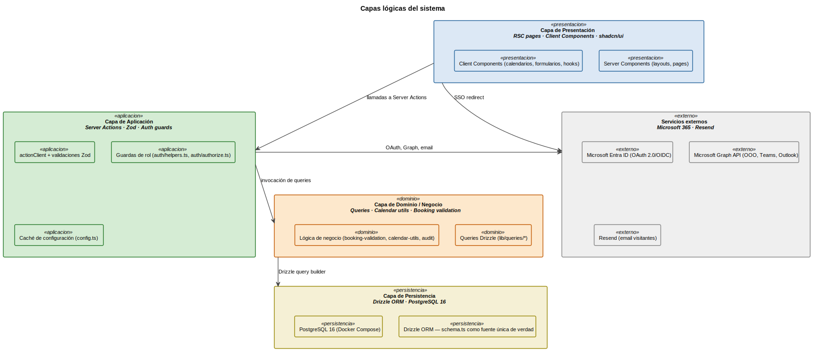
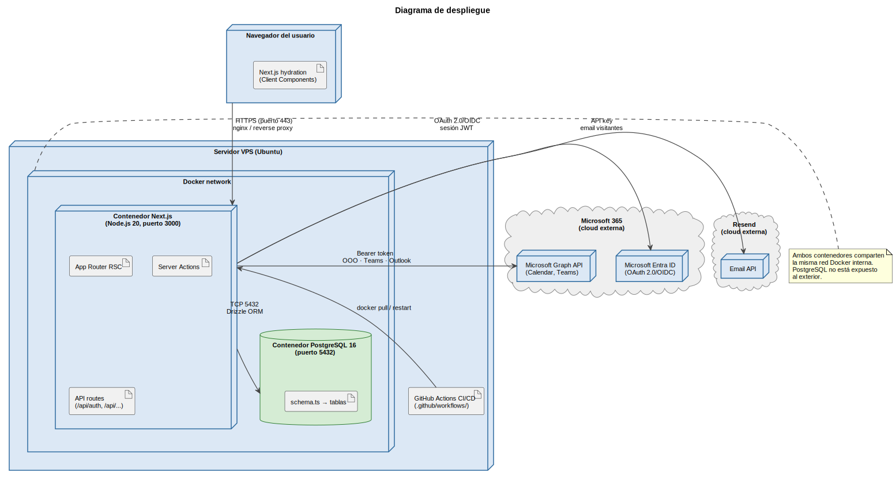
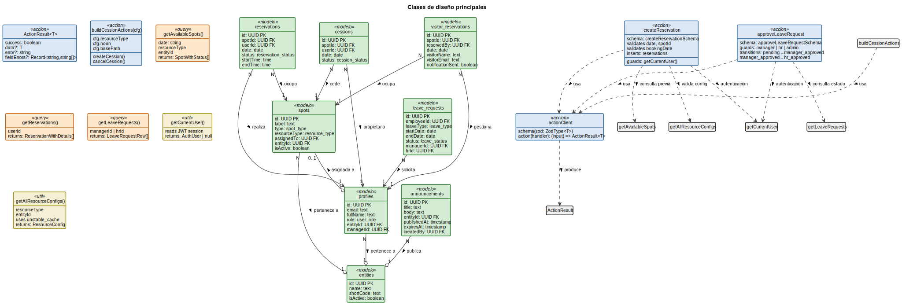
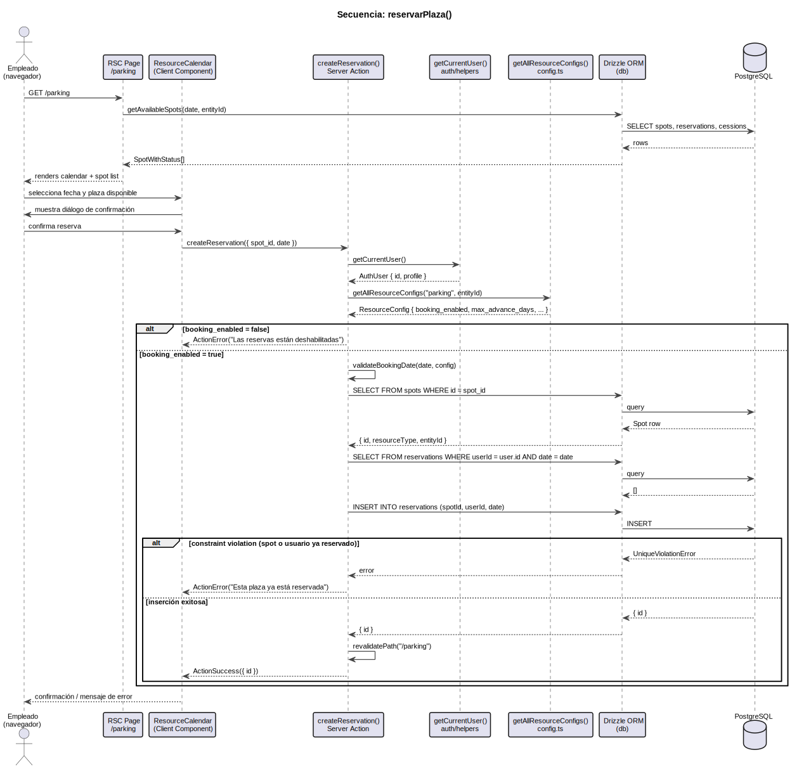
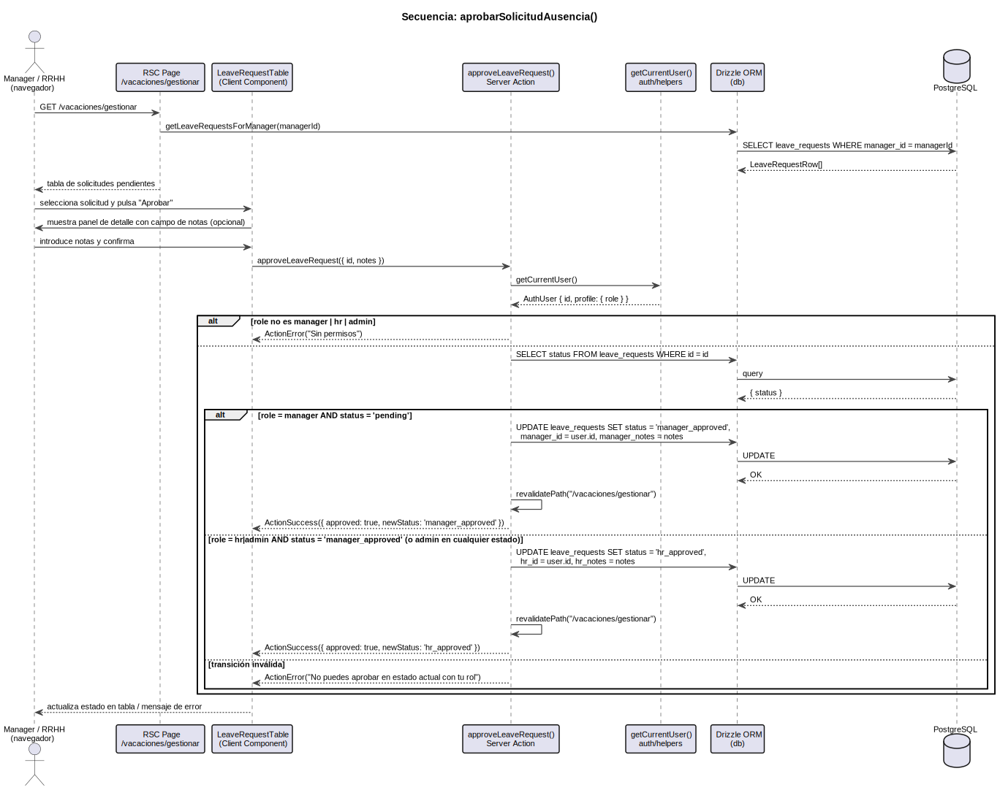
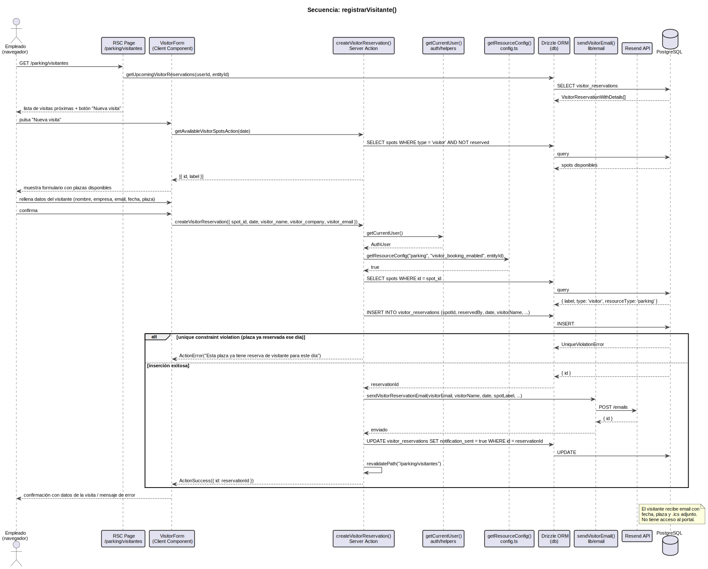
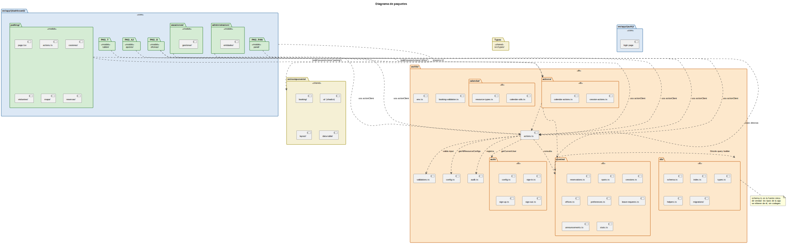
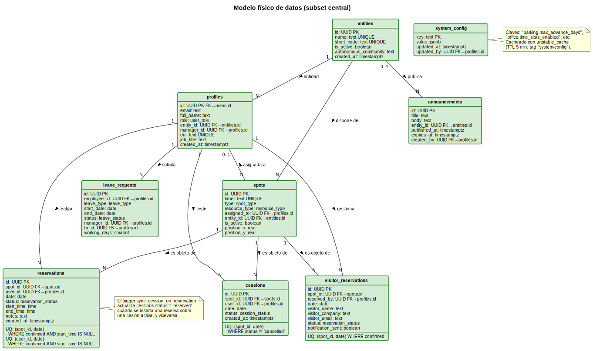

# 4. Análisis y Diseño

El objetivo de esta iteración es construir la abstracción del sistema a partir de los casos de uso formalizados en el capítulo anterior. El resultado es el conjunto de artefactos —arquitectura, clases, paquetes y modelo de datos— que sirven de puente entre el contrato con el cliente (capítulo 3) y el código ejecutable (capítulo 5). A diferencia de los documentos de diseño especulativos, el contenido de este capítulo describe la arquitectura que efectivamente se ha construido y es verificable directamente en el código del repositorio.

## 4.1 Introducción y enfoque

La disciplina de análisis y diseño que prescribe RUP tiene como propósito describir el sistema en el lenguaje de los desarrolladores, introducir formalismo y tomar decisiones sobre el funcionamiento interno. En un proyecto donde la implementación ya está completada, este capítulo cumple esa misma función pero con una ventaja adicional: toda decisión de diseño es constatable. No existe la brecha entre diseño y código que suele aparecer cuando el diseño es anterior al desarrollo.

El enfoque seguido en este capítulo es **híbrido**: en el apartado de análisis (§4.3 y §4.4.1) se expone el modelo clásico RUP con sus clases de análisis (Modelo, Vista, Controlador). En el apartado de diseño (§4.3, §4.4.2 y siguientes) se muestra cómo ese modelo se materializa en la arquitectura real: las clases controladoras colapsan en Server Actions, las clases vista se corresponden con Server Components y Client Components de Next.js, y el modelo del dominio se mapea directamente sobre el esquema Drizzle. Esta articulación entre el modelo de análisis y el diseño concreto permite verificar la trazabilidad entre los conceptos del dominio (capítulo 3) y el código (capítulo 5).

## 4.2 Análisis de la arquitectura

### 4.2.1 Capas lógicas del sistema

El sistema se organiza en cuatro capas lógicas verticales. La separación no es física (el sistema se despliega en un único proceso Next.js) sino de responsabilidad: cada capa tiene una única razón de cambio, y las dependencias fluyen siempre hacia abajo.

[Código fuente](../../modelosUML/puml/arqCapas.puml)

| Capa | Responsabilidad | Artefactos principales |
| --- | --- | --- |
| **Presentación** | Renderizar la UI y capturar interacciones del usuario. No contiene lógica de negocio. | `src/app/(dashboard)/*/page.tsx`, layouts, Client Components, `src/components/` |
| **Aplicación** | Orquestar las operaciones del sistema: validar entrada, comprobar autorización, invocar queries y devolver resultado. | Server Actions (`actions.ts` de cada módulo), `actionClient`, validaciones Zod, guardas de rol |
| **Dominio / Negocio** | Encapsular la lógica de negocio reutilizable independiente de la UI: cálculo de disponibilidad, validación de fechas, reglas de cesión. | `src/lib/queries/`, `src/lib/calendar/`, `src/lib/booking-validation.ts` |
| **Persistencia** | Materializar las entidades del dominio en la base de datos. | `src/lib/db/schema.ts`, `src/lib/db/index.ts`, Drizzle ORM, PostgreSQL 16 |

Los servicios externos (Microsoft Entra ID, Microsoft Graph, Resend) se acceden exclusivamente desde la capa de aplicación, nunca desde la presentación. Esto garantiza que un cambio de proveedor afecta únicamente a las actions correspondientes, sin impacto en la UI.

### 4.2.2 Flujo de una operación típica

Para concretar cómo fluye una operación a través de las capas, se describe el camino de una reserva de parking:

1. **Presentación** — Un Server Component (`/parking/page.tsx`) carga la lista de plazas disponibles para el día seleccionado y la pasa al Client Component de calendario como props. El Client Component renderiza el mapa interactivo y, al confirmar la selección, llama a la Server Action `createReservation`.

2. **Aplicación** — `createReservation` (envuelta en `actionClient`) valida la entrada con el schema Zod, obtiene el usuario autenticado mediante `getCurrentUser()`, comprueba que el módulo está habilitado y que la fecha es válida, e inserta la reserva.

3. **Dominio** — La validación de la fecha de reserva delega en `validateBookingDate()` de `booking-validation.ts`, que comprueba el adelanto máximo y los días permitidos según la configuración del módulo. Las queries de disponibilidad viven en `src/lib/queries/spots.ts`.

4. **Persistencia** — Drizzle construye la sentencia `INSERT INTO reservations ...` con tipado estricto derivado del esquema. Los índices parciales únicos de PostgreSQL garantizan la invariante de unicidad (una plaza, un día, una reserva confirmada) a nivel de base de datos.

5. El resultado asciende en forma de `ActionResult<T>` — un tipo discriminado que el Client Component usa para mostrar confirmación o error, sin que el servidor lance excepciones.

### 4.2.3 Sistemas externos y su frontera

El sistema interactúa con tres servicios externos, cada uno con una función específica y acotada:

| Sistema externo | Protocolo | Función en el sistema | Módulo que lo invoca |
| --- | --- | --- | --- |
| **Microsoft Entra ID** | OAuth 2.0/OIDC | Autenticación SSO: el sistema delega la verificación de identidad. Auth.js v5 gestiona el ciclo de vida del token JWT. | `src/lib/auth/config.ts` |
| **Microsoft Graph API** | REST + Bearer token | Lectura del estado Fuera de Oficina del manager para activar autocesiones; envío de notificaciones por Teams; sincronización con Outlook Calendar. | `src/app/(dashboard)/ajustes/actions.ts`, `src/lib/holidays-sync.ts` |
| **Resend** | REST API | Envío del email de confirmación al visitante externo. Es el único punto del sistema donde se interactúa con un actor que no tiene acceso al portal. | `src/app/(dashboard)/parking/visitantes/actions.ts`, `src/lib/email/` |

## 4.3 Diseño de la arquitectura

### 4.3.1 Stack tecnológico

Las tecnologías empleadas —Next.js 15 App Router, Auth.js v5, Drizzle ORM y PostgreSQL 16— se describen en el §2. Lo relevante aquí es cómo se articulan: un único lenguaje (TypeScript) para todo el stack, un único proceso de despliegue, sin capa de API REST separada. Las lecturas ocurren en Server Components directamente contra la base de datos; las mutaciones pasan por Server Actions envueltas en `actionClient`.

### 4.3.2 Patrón monolito modular con plug-in

El portal sigue el patrón de **monolito modular** descrito en el capítulo 2 (§2.2.5). La estructura se divide en un núcleo fijo y módulos activables:

**Core shell** (siempre activo): autenticación, navegación (`layout.tsx`), configuración del sistema (`system_config` + `config.ts`), auditoría (`audit.ts`) y middleware de protección de rutas (`proxy.ts`).

**Módulos plug-in**: cada módulo reside en su propia carpeta bajo `src/app/(dashboard)/` y puede ser habilitado o deshabilitado por entidad sin modificar el código base. La activación se gestiona en la tabla `entity_modules` y se consulta en el layout mediante `getAllResourceConfigs()`. Los módulos del MVP son: `parking`, `oficinas`, `vacaciones`, `tablon`, `administracion`, `ajustes`, `visitantes`, `directorio`, `mis-reservas` y `panel`.

La lógica que es idéntica entre módulos de la misma familia se extrae a funciones parametrizadas. El caso más representativo es la cesión: `src/lib/actions/cession-actions.ts` expone `buildCessionActions(cfg)`, que recibe el tipo de recurso (`"parking"` | `"office"`) y devuelve las actions `createCession` y `cancelCession` configuradas para ese recurso. Los módulos `parking/cesiones/` y `oficinas/cesiones/` importan esta factory y reexportan las actions correspondientes. Este es el mecanismo de composición sobre herencia que se aplica de forma sistemática en el proyecto.

### 4.3.3 Diagrama de despliegue

El diagrama de despliegue refleja los nodos físicos del sistema en producción. El servidor VPS aloja tanto el proceso Next.js como el contenedor PostgreSQL dentro de la misma red Docker, de modo que la base de datos no está expuesta al exterior. El acceso externo llega exclusivamente a través del reverse proxy (nginx) en el puerto 443.

[Código fuente](../../modelosUML/puml/arqDespliegue.puml)

## 4.4 Análisis y diseño de clases

### 4.4.1 Clases de análisis (modelo RUP)

Siguiendo la clasificación RUP, a partir de los casos de uso del §3.3 se identifican tres categorías de clases:

**Clases Modelo** — Derivadas directamente del modelo del dominio (§3.2.1). Se corresponden con las entidades que persisten en la base de datos: `Empleado`, `Entidad`, `Plaza`, `Reserva`, `Cesión`, `SolicitudAusencia`, `Anuncio`, `CalendarioFestivos`, `ReglaAutoCesión` y `ReservaVisitante`.

**Clases Vista** — Una clase vista por actor primario que representa la ventana principal de interacción:

| Actor | Clase Vista principal |
| --- | --- |
| Empleado | `DashboardView` — navegación y listado de reservas propias |
| Manager | `CesionesView` — gestión de la plaza asignada y cesiones |
| RRHH | `GestionarAusenciasView` — bandeja de solicitudes pendientes |
| Administrador | `AdminView` — CRUD de plazas, usuarios y configuración |

Además, existe una clase vista primitiva por cada clase de modelo: `PlazaView`, `ReservaView`, `CesiónView`, `SolicitudAusenciaView`, `AnuncioView`.

**Clases Controlador** — Una clase controladora por caso de uso relevante. La tabla siguiente mapea los CdU Must del §3.3.3 con su controladora de análisis:

| Caso de Uso | Controladora de análisis |
| --- | --- |
| `reservarPlaza()` | `ReservarPlazaController` |
| `cancelarReservaParking()` | `CancelarReservaParkingController` |
| `cederPlaza()` | `CederPlazaController` |
| `cancelarCesion()` | `CancelarCesionController` |
| `registrarVisitante()` | `RegistrarVisitanteController` |
| `reservarPuesto()` | `ReservarPuestoController` |
| `cancelarReservaPuesto()` | `CancelarReservaPuestoController` |
| `solicitarAusencia()` | `SolicitarAusenciaController` |
| `cancelarSolicitudAusencia()` | `CancelarSolicitudAusenciaController` |
| `aprobarSolicitudAusencia()` | `AprobarSolicitudAusenciaController` |
| `rechazarSolicitudAusencia()` | `RechazarSolicitudAusenciaController` |
| `validarSolicitudAusencia()` | `ValidarSolicitudAusenciaController` |
| `rechazarValidacionAusencia()` | `RechazarValidacionAusenciaController` |
| `editarPerfil()` | `EditarPerfilController` |
| `gestionarPlazas()` | `GestionarPlazasController` |
| `gestionarUsuarios()` | `GestionarUsuariosController` |
| `configurarSistema()` | `ConfigurarSistemaController` |

### 4.4.2 Colapso al diseño real

En el paso del análisis al diseño, las categorías RUP se materializan de la siguiente manera:

**Modelo → Schema Drizzle + capa de queries**

Las clases Modelo del análisis se mapean directamente sobre las tablas de `src/lib/db/schema.ts`. Los tipos de la aplicación (`Profile`, `Spot`, `Reservation`, `Cession`, `LeaveRequest`, `Announcement`, `VisitorReservation`) se derivan de las tablas mediante `$inferSelect`. Las relaciones entre entidades se expresan mediante las `relations` de Drizzle, que permiten hacer joins declarativos sin SQL crudo.

La lógica de consulta (lo que en el modelo de análisis serían las responsabilidades de las clases Modelo) reside en `src/lib/queries/`: cada archivo encapsula las queries de una entidad (`spots.ts`, `reservations.ts`, `cessions.ts`, `offices.ts`, `leave-requests.ts`, `announcements.ts`, etc.).

**Vista → Server Components + Client Components**

Las clases Vista del análisis se realizan como dos tipos de componentes React:

- **Server Components** (`page.tsx`, `layout.tsx`): ejecutan en el servidor, acceden a la base de datos directamente y pasan los datos como props. No tienen estado de cliente. Corresponden a las vistas primarias del modelo de análisis.
- **Client Components** (marcados con `"use client"`): gestionan el estado interactivo (calendario, formularios, diálogos de confirmación). Reciben los datos ya procesados como props del Server Component padre. Corresponden a las vistas primitivas del modelo de análisis.

La librería de UI es [shadcn/ui](https://ui.shadcn.com/), que proporciona componentes accesibles y componibles sin añadir runtime bundle significativo.

**Controlador → Server Actions con `actionClient`**

Las clases Controlador del análisis se realizan como Server Actions. Sin embargo, en lugar de una clase por CdU, el diseño las agrupa por módulo y recurso, lo que reduce la proliferación de archivos sin perder la cohesión:

- `src/app/(dashboard)/parking/actions.ts` → `createReservation`, `cancelReservation`
- `src/app/(dashboard)/parking/visitantes/actions.ts` → `createVisitorReservation`, `cancelVisitorReservation`, `updateVisitorReservation`
- `src/lib/actions/cession-actions.ts` → `buildCessionActions(cfg)` → `createCession`, `cancelCession` (compartido por parking y oficinas)
- `src/app/(dashboard)/vacaciones/actions.ts` → `createLeaveRequest`, `cancelLeaveRequest`, `approveLeaveRequest`, `rejectLeaveRequest`, `updateLeaveRequest`

El constructor `actionClient` cumple el papel que en el modelo de análisis ejercía la clase controladora: recibe el input, lo valida con Zod, obtiene el contexto de autenticación, ejecuta la lógica y devuelve `ActionResult<T>`. La guarda de rol —equivalente a la comprobación de precondición del CdU— se realiza dentro del handler de cada action invocando las funciones de `src/lib/auth/helpers.ts` o lanzando un error si el rol es insuficiente.

### 4.4.3 Diagrama de clases de diseño

El diagrama siguiente muestra las clases de diseño principales con sus atributos, responsabilidades y relaciones.

[Código fuente](../../modelosUML/puml/clasesDiseño.puml)

### 4.4.4 Patrones aplicados

**Factory parametrizada por tipo de recurso.** El patrón más característico del diseño es `buildCessionActions(cfg)`. Parking y oficinas comparten exactamente la misma lógica de cesión salvo el tipo de recurso, las rutas de revalidación y los mensajes de error. En lugar de duplicar el código o crear una jerarquía de herencia, se parametriza la función con un objeto de configuración `CessionConfig`. Este mismo patrón se aplica en `src/lib/actions/calendar-actions.ts` para las acciones de calendario compartidas.

**`ActionResult<T>` como contrato uniforme.** Todas las Server Actions devuelven un tipo discriminado `ActionResult<T>` que es bien `{ success: true, data: T }` o bien `{ success: false, error: string, fieldErrors? }`. Esto elimina el manejo inconsistente de excepciones en los clientes y permite exhaustividad en los `if (result.success)` de los componentes.

**Guardas de rol por composición.** La autorización no se implementa en un middleware centralizado sino mediante funciones de guarda `assertAdmin()`, `assertHROrAbove()`, `assertManagerOrAbove()`, `assertCanManageReservation()` en `src/lib/auth/` que se invocan al inicio del handler de cada action. Cada guarda comprueba una única condición y lanza si no se cumple, permitiendo componer múltiples guardas en una misma action.

**Una fuente de verdad para el modelo de datos.** `src/lib/db/schema.ts` define todas las tablas, enumeraciones, relaciones e índices. Los tipos TypeScript de la aplicación se derivan de él. No existe ningún archivo de tipos mantenido manualmente para las entidades de la base de datos.

## 4.5 Diseño de casos de uso representativos

Se presentan los diagramas de secuencia de los cuatro casos de uso más representativos del sistema, siguiendo el flujo UI → Action → Query → DB. Los casos se seleccionan porque cubren los cuatro patrones de interacción fundamentales: reserva estándar, cesión por propietario, aprobación multinivel y notificación a actor externo.

### 4.5.1 `reservarPlaza()`

La secuencia muestra el camino completo de la reserva de parking, incluyendo la validación de configuración del módulo, la comprobación de unicidad y el manejo del constraint de base de datos.

[Código fuente](../../modelosUML/puml/seqReservarPlaza.puml)

### 4.5.2 `aprobarSolicitudAusencia()`

Este caso de uso exhibe la lógica de transición de estado condicional al rol: un manager solo puede aprobar desde `pending` hacia `manager_approved`; RRHH solo puede hacerlo desde `manager_approved` hacia `hr_approved`. La misma action gestiona ambas transiciones con una única consulta de estado previo.

[Código fuente](../../modelosUML/puml/seqAprobarSolicitudAusencia.puml)

### 4.5.3 `registrarVisitante()`

La única secuencia del sistema que cruza la frontera hacia un actor externo pasivo. Tras la inserción en base de datos, la action llama a `sendVisitorReservationEmail()` que invoca la API de Resend con el email del visitante y un archivo `.ics` adjunto. El campo `notification_sent` garantiza la trazabilidad del envío.

[Código fuente](../../modelosUML/puml/seqRegistrarVisitante.puml)

## 4.6 Diseño de paquetes

### 4.6.1 Árbol de `src/` con responsabilidad por paquete

| Paquete | Responsabilidad |
| --- | --- |
| `src/app/(auth)/` | Páginas de autenticación (`/login`, `/register`). No requieren sesión activa. |
| `src/app/(dashboard)/` | Módulos del portal. Cada subcarpeta es un módulo activable con su propio `page.tsx` y `actions.ts`. |
| `src/app/api/` | Rutas de API necesarias para integraciones externas: callback de Auth.js, webhook de Microsoft Graph. |
| `src/lib/db/` | Schema, conexión Drizzle, migraciones, seed, tipos inferidos. Capa de persistencia. |
| `src/lib/auth/` | Configuración de Auth.js, helpers de sesión, guardas de rol para Server Components y Server Actions. |
| `src/lib/queries/` | Funciones de consulta puras: reciben parámetros tipados y devuelven datos tipados. No contienen lógica de negocio. |
| `src/lib/actions/` | Lógica de acción compartida entre módulos (cession-actions, calendar-actions). Exporta factories, no actions directas. |
| `src/lib/calendar/` | Utilidades de calendario reutilizables entre parking y oficinas: `buildMonthRange`, `computeCessionDayStatus`, `iterMonthDays`. |
| `src/lib/email/` | Wrappers sobre la API de Resend para los correos del sistema. |
| `src/components/` | Componentes UI compartidos entre módulos: `ResourceCalendar`, tablas de datos, layouts, `CommandMenu`. |
| `src/types/` | Tipos de la capa de aplicación: `SpotWithStatus`, `ReservationWithDetails`, `TimeSlot`. |

### 4.6.2 Reglas de dependencia

Las reglas de dependencia entre paquetes siguen el principio de dependencias hacia adentro (de la presentación hacia la persistencia, nunca al revés):

1. **Los módulos de ruta** (`src/app/(dashboard)/*/`) pueden importar de `src/lib/` y `src/components/`. No importan entre sí.
2. **Las queries** (`src/lib/queries/`) importan únicamente de `src/lib/db/`. No importan de actions ni de componentes.
3. **Las actions** (`src/lib/actions/`, actions de módulos) importan de `src/lib/queries/`, `src/lib/auth/`, `src/lib/db/` y `src/lib/validations.ts`. No importan de componentes.
4. **Los componentes** (`src/components/`) importan de `src/types/` y de la librería UI. No importan de `src/lib/db/` directamente.
5. **`src/lib/db/schema.ts`** no importa nada del proyecto. Es la raíz del grafo de dependencias.

Esta estructura garantiza que un cambio en el esquema de la base de datos produce errores de compilación precisamente en los archivos que acceden a los datos afectados, facilitando el mantenimiento correctivo.

### 4.6.3 Diagrama de paquetes

[Código fuente](../../modelosUML/puml/paquetes.puml)

## 4.7 Modelo físico de datos

### 4.7.1 Diagrama entidad-relación del subset central

El modelo físico central comprende las siete tablas que implementan la funcionalidad del MVP. Las tablas de soporte (autenticación, preferencias, tokens M365, festivos, auditoría, configuración) no se incluyen en este diagrama pero forman parte del esquema completo de `schema.ts`.

[Código fuente](../../modelosUML/puml/modeloFisico.puml)

### 4.7.2 Restricciones críticas del modelo

**Índices parciales únicos en `reservations`.** La invariante «una plaza confirmada por día, un empleado confirmado por día» se impone con dos índices parciales que solo aplican a reservas confirmadas sin franja horaria. El uso de índices parciales —en lugar de constraints simples— permite que los puestos de oficina con time slots acumulen varias reservas el mismo día sin violar la restricción.

**Índice parcial único en `cessions`.** Una plaza no puede tener dos cesiones activas el mismo día. El índice parcial excluye las cesiones canceladas, de modo que una cesión cancelada libera la fecha para una nueva.

**Trigger de sincronización `cessions` ↔ `reservations`.** Cuando se inserta una reserva sobre una cesión activa, el trigger actualiza `cessions.status = 'reserved'`; al cancelar la reserva, lo revierte a `'available'`. La sincronización vive en la base de datos para garantizar atomicidad sin lógica manual en la aplicación.

**Constraint de exclusión `btree_gist`.** Para los puestos de oficina con franja horaria, un constraint de exclusión GiST impide solapamientos temporales en la misma plaza y día. Permite coexistir reservas no solapadas y rechaza atómicamente cualquier intento de insertar un solapamiento.

### 4.7.3 Decisión de autorización en aplicación

El modelo prescinde de Row Level Security (RLS) de PostgreSQL. La autorización se gestiona íntegramente en la capa de aplicación mediante las guardas de rol de `src/lib/auth/`. Esta decisión responde a tres motivos: (1) las consultas con RLS en Drizzle añaden complejidad de configuración sin alinearse con la API del ORM; (2) la lógica de autorización es específica del dominio de negocio (un manager solo gestiona su propio equipo dentro de su entidad) y es más expresiva en TypeScript que en SQL; (3) el aislamiento entre entidades se garantiza añadiendo filtros de `entityId` explícitos en todas las queries que manejan datos sensibles.

## 4.8 Trazabilidad requisito → diseño

La tabla siguiente cierra el ciclo de trazabilidad entre los casos de uso del capítulo 3 (§3.3.3) y los artefactos de diseño e implementación concretos. Cada fila establece la cadena completa: CdU → módulo → Server Action → query → tabla.

| CdU | Prioridad | Módulo | Server Action | Query / tabla principal |
| --- | --- | --- | --- | --- |
| `autenticarse()` | Must | `src/lib/auth/` | `signIn()` Auth.js | `users`, `profiles` |
| `reservarPlaza()` | Must | `parking/` | `createReservation` | `getAvailableSpots` → `reservations` |
| `cancelarReservaParking()` | Must | `parking/` | `cancelReservation` | `reservations` (UPDATE status) |
| `cederPlaza()` | Must | `parking/cesiones/` | `createCession` (buildCessionActions) | `cessions` (INSERT) |
| `cancelarCesion()` | Must | `parking/cesiones/` | `cancelCession` (buildCessionActions) | `cessions` (UPDATE status) |
| `registrarVisitante()` | Must | `parking/visitantes/` | `createVisitorReservation` | `visitor_reservations` + Resend API |
| `reservarPuesto()` | Must | `oficinas/` | `createOfficeReservation` | `getAvailableOfficeSpots` → `reservations` |
| `cancelarReservaPuesto()` | Must | `oficinas/` | `cancelOfficeReservation` | `reservations` (UPDATE status) |
| `solicitarAusencia()` | Must | `vacaciones/` | `createLeaveRequest` | `leave_requests` (INSERT) |
| `cancelarSolicitudAusencia()` | Must | `vacaciones/` | `cancelLeaveRequest` | `leave_requests` (UPDATE status) |
| `aprobarSolicitudAusencia()` | Must | `vacaciones/` | `approveLeaveRequest` | `leave_requests` (UPDATE status→manager_approved) |
| `rechazarSolicitudAusencia()` | Must | `vacaciones/` | `rejectLeaveRequest` | `leave_requests` (UPDATE status→rejected) |
| `validarSolicitudAusencia()` | Must | `vacaciones/` | `approveLeaveRequest` (rol hr) | `leave_requests` (UPDATE status→hr_approved) |
| `rechazarValidacionAusencia()` | Must | `vacaciones/` | `rejectLeaveRequest` (rol hr) | `leave_requests` (UPDATE status→rejected) |
| `editarPerfil()` | Must | `ajustes/` | `updateProfile` | `profiles` (UPDATE) |
| `gestionarPlazas()` | Must | `administracion/` | `createSpot`, `updateSpot`, `deleteSpot` | `spots` |
| `gestionarUsuarios()` | Must | `administracion/` | `updateUserRole`, `assignSpotToUser`, `deleteUser` | `profiles`, `spots` |
| `configurarSistema()` | Must | `configuracion/` | `updateGlobalConfig`, `updateParkingConfig`, `updateOfficeConfig` | `system_config`, `entity_config` |
| `cancelarVisitante()` | Should | `parking/visitantes/` | `cancelVisitorReservation` | `visitor_reservations` (UPDATE status) |
| `configurarReglaCesion()` | Should | `ajustes/` | `updateCessionRules` | `cession_rules` |
| `configurarPreferencias()` | Should | `ajustes/` | `updateNotificationPreferences`, `updateOutlookPreferences` | `user_preferences` |
| `conectarMicrosoft365()` | Should | `ajustes/` | OAuth flow + `forceCalendarSync` | `user_microsoft_tokens` |
| `consultarTablon()` | Should | `tablon/` | — (lectura RSC) | `announcements` (SELECT) |
| `publicarAnuncio()` | Should | `tablon/` | `createAnnouncement`, `updateAnnouncement` | `announcements` |
| `consultarDirectorio()` | Should | `directorio/` | — (lectura RSC) | `profiles`, `entities` (SELECT) |
| `gestionarEntidades()` | Should | `administracion/entidades/` | `createEntity`, `updateEntity`, `deleteEntity` | `entities` |
| `configurarModulos()` | Should | `administracion/entidades/` | `toggleEntityModule` | `entity_modules` |
| `consultarAnalytics()` | Could | `panel/` | — (lectura RSC) | `stats.ts` → múltiples tablas |
